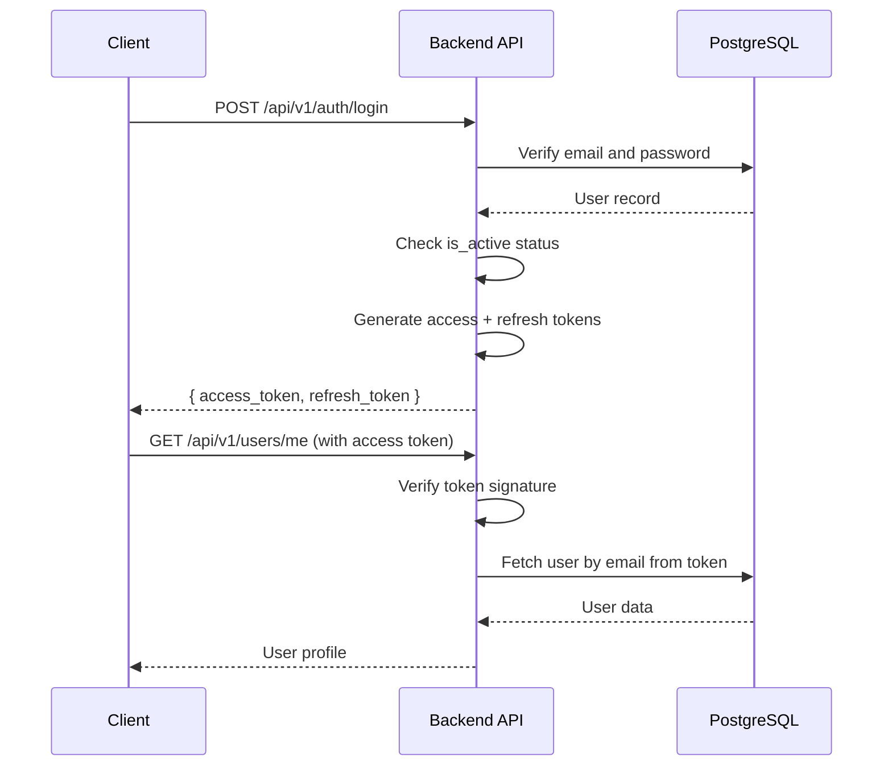

CALZADO J&R uses a secure JWT (JSON Web Token) authentication system with bcrypt password hashing, role-based access control, and comprehensive token management.

## Authentication flow

The system implements a dual-token strategy with access tokens for API requests and refresh tokens for session management.



## Token types and expiration

The system uses two types of JWT tokens with different lifespans:

<Tabs>
  <Tab title="Access Token">
    ### Access token
    
    Short-lived token for API authentication.
    
    **Lifespan:** 15 minutes (default)
    
    **Configuration:**
    ```python
    # From config.py:25
    ACCESS_TOKEN_EXPIRE_MINUTES: int = 15
    ```
    
    **Token payload:**
    ```json
    {
      "sub": "user@example.com",
      "exp": 1709483400,
      "type": "access"
    }
    ```
    
    **Usage:**
    - Sent in `Authorization: Bearer <token>` header
    - Required for all protected endpoints
    - Validated on every API request
    
    <Note>
      Access tokens have a short lifespan to minimize damage if compromised. Use refresh tokens to get new access tokens.
    </Note>
  </Tab>
  
  <Tab title="Refresh Token">
    ### Refresh token
    
    Long-lived token for obtaining new access tokens without re-login.
    
    **Lifespan:** 7 days (default)
    
    **Configuration:**
    ```python
    # From config.py:26
    REFRESH_TOKEN_EXPIRE_DAYS: int = 7
    ```
    
    **Token payload:**
    ```json
    {
      "sub": "user@example.com",
      "exp": 1710088200,
      "type": "refresh"
    }
    ```
    
    **Usage:**
    - Stored securely in client (e.g., httpOnly cookie)
    - Used to request new access tokens
    - Must have `type="refresh"` in payload
    
    <Warning>
      Refresh tokens should be stored securely. Never expose them in URL parameters or localStorage without encryption.
    </Warning>
  </Tab>
</Tabs>

## Password security

### Hashing with bcrypt

All passwords are hashed using bcrypt before storage:

```python
# From utils/security.py:15-25
from passlib.context import CryptContext

pwd_context = CryptContext(schemes=["bcrypt"], deprecated="auto")

def hash_password(password: str) -> str:
    """Hashea una contraseña en texto plano usando bcrypt."""
    return pwd_context.hash(password)

def verify_password(plain_password: str, hashed_password: str) -> bool:
    """Verifica si una contraseña en texto plano coincide con su hash."""
    return pwd_context.verify(plain_password, hashed_password)
```

**Security features:**
- Automatic salt generation
- Configurable work factor (cost)
- Password verification timing attack protection
- Future algorithm migration support (`deprecated="auto"`)

<Note>
  Bcrypt is deliberately slow to prevent brute-force attacks. Never store plain-text passwords in the database.
</Note>

### Password validation rules

While not enforced at the database level, implement these best practices in your frontend:

- Minimum 8 characters
- Mix of uppercase and lowercase letters
- At least one number
- At least one special character
- Not a common password (check against dictionary)

## Login endpoint

The login process validates credentials and returns both tokens:

```typescript
POST /api/v1/auth/login
Content-Type: application/json

{
  "email": "user@example.com",
  "password": "userPassword123"
}
```

**Successful response (HTTP 200):**
```json
{
  "access_token": "eyJhbGciOiJIUzI1NiIsInR5cCI6IkpXVCJ9...",
  "refresh_token": "eyJhbGciOiJIUzI1NiIsInR5cCI6IkpXVCJ9...",
  "token_type": "bearer"
}
```

**Error responses:**

<AccordionGroup>
  <Accordion title="401 Unauthorized - Invalid credentials">
    ```json
    {
      "detail": "Credenciales inválidas"
    }
    ```
    
    Returned when:
    - Email doesn't exist
    - Password is incorrect
  </Accordion>
  
  <Accordion title="403 Forbidden - Unvalidated account">
    ```json
    {
      "detail": "Cuenta pendiente de validación por el administrador."
    }
    ```
    
    Returned when:
    - `is_active=False` (client not yet validated by admin)
  </Accordion>
</AccordionGroup>

### Login implementation

```python
# From auth_service.py:77-101
def login_user(db: Session, login_data: UserLogin) -> TokenResponse:
    """Autentica un usuario y retorna tokens JWT."""
    stmt = select(User).where(User.email == login_data.email)
    user = db.execute(stmt).scalar_one_or_none()

    if not user or not verify_password(login_data.password, user.hashed_password):
        raise HTTPException(
            status_code=status.HTTP_401_UNAUTHORIZED,
            detail="Credenciales inválidas",
            headers={"WWW-Authenticate": "Bearer"},
        )

    if not user.is_active:
        raise HTTPException(
            status_code=status.HTTP_403_FORBIDDEN,
            detail="Cuenta pendiente de validación por el administrador.",
        )

    access_token = create_access_token(data={"sub": user.email})
    refresh_token = create_refresh_token(data={"sub": user.email})

    return TokenResponse(
        access_token=access_token,
        refresh_token=refresh_token,
    )
```

<Warning>
  The system returns the same error message for non-existent emails and incorrect passwords to prevent email enumeration attacks.
</Warning>

## Token refresh

When the access token expires, use the refresh token to obtain a new pair:

```typescript
POST /api/v1/auth/refresh
Content-Type: application/json

{
  "refresh_token": "eyJhbGciOiJIUzI1NiIsInR5cCI6IkpXVCJ9..."
}
```

**Successful response (HTTP 200):**
```json
{
  "access_token": "eyJhbGciOiJIUzI1NiIsInR5cCI6IkpXVCJ9...",
  "refresh_token": "eyJhbGciOiJIUzI1NiIsInR5cCI6IkpXVCJ9...",
  "token_type": "bearer"
}
```

**Validation steps:**

<Steps>
  <Step title="Decode token">
    Verify JWT signature using `SECRET_KEY`
  </Step>
  <Step title="Check token type">
    Ensure `payload["type"] == "refresh"`
  </Step>
  <Step title="Check expiration">
    Verify token hasn't expired
  </Step>
  <Step title="Fetch user">
    Load user from database using `payload["sub"]` (email)
  </Step>
  <Step title="Verify account status">
    Ensure `is_active == True`
  </Step>
  <Step title="Issue new tokens">
    Generate fresh access and refresh tokens
  </Step>
</Steps>

```python
# From auth_service.py:104-137
def refresh_access_token(db: Session, refresh_token: str) -> TokenResponse:
    payload = decode_token(refresh_token)

    if not payload or payload.get("type") != "refresh":
        raise HTTPException(
            status_code=status.HTTP_401_UNAUTHORIZED,
            detail="Refresh token inválido o expirado",
        )

    email = payload.get("sub")
    user = db.execute(select(User).where(User.email == email)).scalar_one_or_none()

    if not user or not user.is_active:
        raise HTTPException(
            status_code=status.HTTP_401_UNAUTHORIZED,
            detail="Usuario no encontrado o cuenta desactivada",
        )

    new_access = create_access_token(data={"sub": user.email})
    new_refresh = create_refresh_token(data={"sub": user.email})

    return TokenResponse(access_token=new_access, refresh_token=new_refresh)
```

## Protected endpoints

All protected endpoints use the `get_current_user` dependency to verify authentication:

```python
# From dependencies.py:32-66
def get_current_user(
    token: str = Depends(oauth2_scheme),
    db: Session = Depends(get_db),
) -> User:
    """Obtiene el usuario autenticado a partir del access token JWT."""
    credentials_exception = HTTPException(
        status_code=status.HTTP_401_UNAUTHORIZED,
        detail="No se pudieron validar las credenciales",
        headers={"WWW-Authenticate": "Bearer"},
    )

    payload = decode_token(token)
    if not payload:
        raise credentials_exception

    if payload.get("type") != "access":
        raise credentials_exception

    email = payload.get("sub")
    if not email:
        raise credentials_exception

    user = db.execute(select(User).where(User.email == email)).scalar_one_or_none()

    if not user:
        raise credentials_exception

    if not user.is_active:
        raise HTTPException(
            status_code=status.HTTP_403_FORBIDDEN,
            detail="Cuenta desactivada",
        )

    return user
```

**Example usage:**

```python
# From routers/users.py:20-41
@router.get("/me", response_model=UserResponse)
def get_me(current_user: User = Depends(get_current_user)) -> UserResponse:
    """Retorna los datos del usuario autenticado."""
    return UserResponse(
        id=current_user.id,
        email=current_user.email,
        full_name=current_user.full_name,
        # ... other fields
    )
```

<Note>
  The OAuth2PasswordBearer scheme automatically extracts the token from the `Authorization: Bearer <token>` header.
</Note>

## Password management

### Change password (authenticated)

Logged-in users can change their password:

```typescript
POST /api/v1/auth/change-password
Authorization: Bearer <access_token>
Content-Type: application/json

{
  "current_password": "oldPassword123",
  "new_password": "newSecurePassword456"
}
```

**Implementation:**

```python
# From auth_service.py:140-149
def change_password(db: Session, user: User, password_data: ChangePasswordRequest):
    if not verify_password(password_data.current_password, user.hashed_password):
        raise HTTPException(
            status_code=status.HTTP_400_BAD_REQUEST,
            detail="La contraseña actual es incorrecta",
        )

    user.hashed_password = hash_password(password_data.new_password)
    db.commit()
```

### Forgot password flow

For users who can't log in, the system provides a secure password reset mechanism:

<Steps>
  <Step title="Request reset">
    ```typescript
    POST /api/v1/auth/forgot-password
    
    {
      "email": "user@example.com"
    }
    ```
    
    System always returns success, even if email doesn't exist (prevents enumeration).
  </Step>
  
  <Step title="Generate token">
    Backend creates a record in `password_reset_tokens` table:
    ```python
    reset_token = str(uuid.uuid4())
    token_record = PasswordResetToken(
        user_id=user.id,
        token=reset_token,
        expires_at=datetime.now(timezone.utc) + timedelta(hours=1),
        used=False,
    )
    ```
  </Step>
  
  <Step title="Send email">
    User receives email with reset link:
    ```
    https://yourapp.com/reset-password?token=<uuid>
    ```
  </Step>
  
  <Step title="Reset password">
    ```typescript
    POST /api/v1/auth/reset-password
    
    {
      "token": "<uuid-from-email>",
      "new_password": "newSecurePassword789"
    }
    ```
  </Step>
  
  <Step title="Validation">
    Backend verifies:
    - Token exists
    - Not already used (`used=False`)
    - Not expired (< 1 hour old)
    - User still exists
  </Step>
  
  <Step title="Update password">
    ```python
    user.hashed_password = hash_password(reset_data.new_password)
    token_record.used = True
    db.commit()
    ```
  </Step>
</Steps>

**Security features:**
- One-time use tokens
- 1-hour expiration
- No email enumeration (always returns success)
- Cascade deletion if user is deleted

<Warning>
  Password reset tokens are single-use only. After successful reset, the token is marked as `used=True` and cannot be reused.
</Warning>

## JWT configuration

All JWT operations use environment variables for security:

```python
# From config.py:20-26
class Settings(BaseSettings):
    SECRET_KEY: str                        # Required: JWT signing key
    ALGORITHM: str = "HS256"               # HMAC-SHA256
    ACCESS_TOKEN_EXPIRE_MINUTES: int = 15  # Short-lived
    REFRESH_TOKEN_EXPIRE_DAYS: int = 7     # Long-lived
```

**Generate a secure SECRET_KEY:**

```bash
python -c "import secrets; print(secrets.token_urlsafe(48))"
```

This generates a cryptographically secure 48-byte key suitable for production use.

<Warning>
  Never commit your SECRET_KEY to version control. Store it in `.env` files that are gitignored.
</Warning>

## Account states

Users have three boolean flags that control access:

| Field | Purpose | Set by |
|-------|---------|--------|
| `is_active` | Account can log in | Admin validation or employee creation |
| `is_validated` | Admin has reviewed account | Admin approval |
| `must_change_password` | Force password reset on next login | Employee creation |

**State combinations:**

<Tabs>
  <Tab title="New Client">
    ```python
    is_active=False
    is_validated=False
    must_change_password=False
    ```
    
    **Status:** Cannot log in, pending admin validation
  </Tab>
  
  <Tab title="Validated Client">
    ```python
    is_active=True
    is_validated=True
    must_change_password=False
    ```
    
    **Status:** Full access to client dashboard
  </Tab>
  
  <Tab title="New Employee">
    ```python
    is_active=True
    is_validated=True
    must_change_password=True
    ```
    
    **Status:** Can log in but forced to change password
  </Tab>
  
  <Tab title="Active Employee">
    ```python
    is_active=True
    is_validated=True
    must_change_password=False
    ```
    
    **Status:** Full access to employee dashboard
  </Tab>
</Tabs>

## Security best practices

<CardGroup cols={2}>
  <Card title="Token storage" icon="lock">
    - Store refresh tokens in httpOnly cookies
    - Never expose tokens in URLs
    - Clear tokens on logout
  </Card>
  
  <Card title="HTTPS only" icon="shield">
    - Always use HTTPS in production
    - JWT tokens are not encrypted, only signed
    - Tokens can be read if intercepted
  </Card>
  
  <Card title="Token rotation" icon="rotate">
    - Issue new refresh token on each refresh
    - Invalidate old tokens after use
    - Implement token revocation list if needed
  </Card>
  
  <Card title="Rate limiting" icon="gauge">
    - Limit login attempts per IP
    - Implement account lockout after failures
    - Add CAPTCHA after repeated failures
  </Card>
</CardGroup>