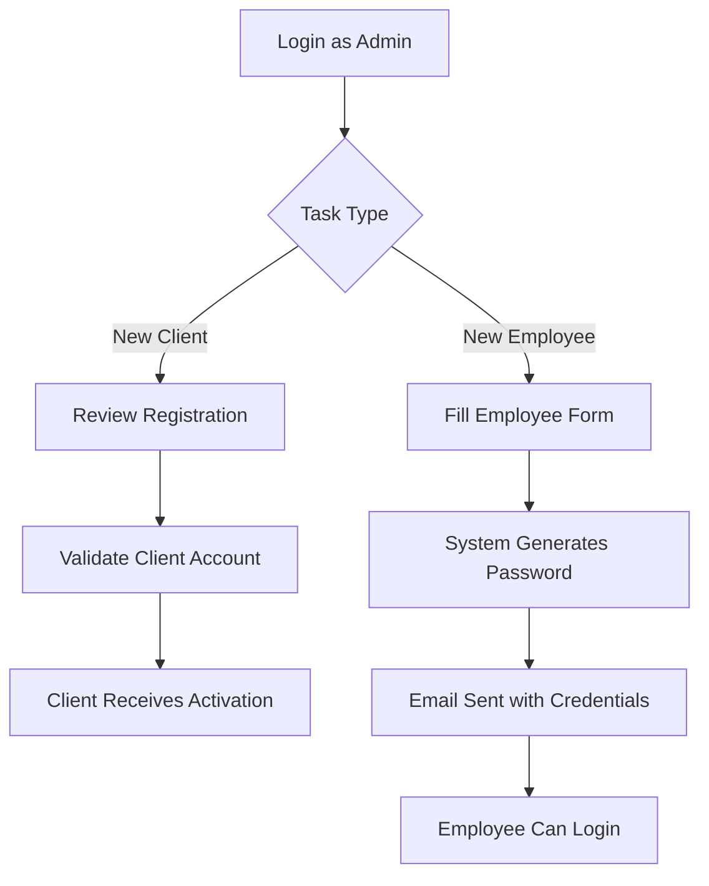

CALZADO J&R implements a role-based access control (RBAC) system with three distinct user types. Each role has specific permissions, creation workflows, and dashboard access.

## Role overview

The system defines three roles in the `roles` table at initialization:

<CardGroup cols={3}>
  <Card title="Admin" icon="user-shield">
    Full system access with user management capabilities
  </Card>
  <Card title="Employee" icon="user-hard-hat">
    Task execution and production workflow management
  </Card>
  <Card title="Client" icon="user">
    Order placement and catalog browsing
  </Card>
</CardGroup>

## Admin role

Administrators have complete control over the system and manage all other users.

### Creation method

<Warning>
  Admin accounts **cannot be created through the web interface**. They must be created manually via database script.
</Warning>

**Initial admin creation:**
```bash
# Inside the backend container
docker compose exec be python scripts/create_admin.py
```

**Creating additional admins:**
Existing admins can create more admin accounts through the admin dashboard.

### Permissions and capabilities

<AccordionGroup>
  <Accordion title="User management">
    - Validate client registrations
    - Create employee accounts
    - Create additional admin accounts
    - Deactivate/reactivate user accounts
    - View validation history (`validated_by` and `validated_at` fields)
  </Accordion>
  
  <Accordion title="System access">
    - Access to admin dashboard
    - Full CRUD operations on all resources
    - System configuration
    - Audit log viewing
  </Accordion>
</AccordionGroup>

### Admin workflow



<Note>
  When an admin validates a client account, the system sets `is_active=True`, `is_validated=True`, records the admin's ID in `validated_by`, and timestamps the action in `validated_at`.
</Note>

## Employee role

 Employees work in the factory and manage their assigned production tasks.

### Creation method

<Warning>
  Employees **cannot self-register**. Only admins can create employee accounts.
</Warning>

**Creation process:**

1. Admin fills out employee creation form with:
   - Email
   - Full name
   - Phone
   - Occupation (guarnición, solador, cortador, emplantillador)

2. System automatically:
   - Generates secure temporary password
   - Creates account with `is_active=True`, `is_validated=True`, `must_change_password=True`
   - Sends email with credentials

3. Employee receives email with:
   - Username (email)
   - Temporary password
   - Instructions to change password on first login

### Occupation types

The `occupation` field in the users table stores one of four factory roles:

<Tabs>
  <Tab title="Guarnición">
    Upper assembly specialist - attaches shoe uppers to soles
  </Tab>
  <Tab title="Solador">
    Sole attachment specialist - applies and secures soles
  </Tab>
  <Tab title="Cortador">
    Cutting specialist - cuts leather and materials
  </Tab>
  <Tab title="Emplantillador">
    Insole specialist - prepares and installs insoles
  </Tab>
</Tabs>

### First login workflow

```python
# Backend validation in auth_service.py:77-93
if not user.is_active:
    raise HTTPException(
        status_code=status.HTTP_403_FORBIDDEN,
        detail="Cuenta pendiente de validación por el administrador.",
    )
```

When `must_change_password=True`, the frontend forces a password change screen before dashboard access.

### Permissions and capabilities

- View assigned tasks dashboard
- Update task progress and status
- View production schedules
- Access limited to own tasks
- Cannot create or modify users
- Cannot access admin functions

<Note>
  Employee accounts are created with `is_active=True` immediately because they're created by trusted admins, unlike client accounts which require validation.
</Note>

## Client role

Clients place orders and browse the product catalog.

### Creation method

Clients can **self-register** through the public registration form.

**Registration endpoint:**
```typescript
POST /api/v1/auth/register

{
  "email": "client@example.com",
  "password": "securePassword123",
  "full_name": "Juan Pérez",
  "phone": "+57 300 123 4567",
  "business_name": "Zapatos El Sol"  // Optional
}
```

**Backend registration logic:**
```python
# From auth_service.py:35-74
def register_user(db: Session, user_data: UserCreate) -> User:
    # Check for duplicate email
    existing_user = db.execute(
        select(User).where(User.email == user_data.email)
    ).scalar_one_or_none()
    
    if existing_user:
        raise HTTPException(
            status_code=status.HTTP_400_BAD_REQUEST,
            detail="El email ya está registrado",
        )
    
    # Create with inactive status
    new_user = User(
        email=user_data.email,
        full_name=user_data.full_name,
        hashed_password=hash_password(user_data.password),
        role_id=client_role.id,
        is_active=False,       # Requires validation
        is_validated=False,    # Pending admin approval
    )
```

### Validation workflow

<Steps>
  <Step title="Client registers">
    Client submits registration form
    
    Account created with:
    - `is_active=False`
    - `is_validated=False`
    - `role_id` = client role UUID
  </Step>
  
  <Step title="Pending state">
    System displays: "Cuenta creada exitosamente. Pendiente de validación por administrador"
    
    Client cannot log in yet
  </Step>
  
  <Step title="Admin reviews">
    Admin sees pending registrations in dashboard
    
    Admin reviews client information and decides to approve or reject
  </Step>
  
  <Step title="Account activation">
    Admin validates the account
    
    System updates:
    - `is_active=True`
    - `is_validated=True`
    - `validated_by` = admin's UUID
    - `validated_at` = current timestamp
  </Step>
  
  <Step title="Client access granted">
    Client can now log in and access their dashboard
  </Step>
</Steps>

<Warning>
  Login attempts from unvalidated clients return: "Cuenta pendiente de validación por el administrador." (HTTP 403)
</Warning>

### Business name field

Clients can optionally provide a `business_name` for commercial accounts:

- **Individual clients**: Leave blank or provide personal name
- **Business clients**: Provide store or company name (e.g., "Zapatos El Sol")

This field is nullable and specific to the client role.

### Permissions and capabilities

- Browse product catalog
- Place new orders
- View order history and status
- Update profile information
- Cannot access admin or employee functions
- Cannot view other clients' data

## Role-based routing

The system automatically routes users to role-specific dashboards after login:

```typescript
// Login endpoint returns tokens
POST /api/v1/auth/login → { access_token, refresh_token }

// Frontend decodes token to get user role
GET /api/v1/users/me → { role_name: "admin" | "employee" | "client" }

// Frontend redirects based on role
switch (role_name) {
  case "admin":
    navigate("/admin/dashboard");
    break;
  case "employee":
    navigate("/employee/tasks");
    break;
  case "client":
    navigate("/client/orders");
    break;
}
```

## Database role reference

Roles are stored in the `roles` table and referenced by UUID in the `users` table:

```sql
-- Initial roles inserted at database initialization
INSERT INTO roles (name, description) VALUES
    ('admin', 'Administrador del sistema — acceso completo'),
    ('employee', 'Empleado de la fábrica — gestión de tareas asignadas'),
    ('client', 'Cliente — gestión de pedidos y catálogo')
ON CONFLICT (name) DO NOTHING;
```

Each user has exactly one role via the foreign key constraint:

```python
# From models/user.py:60-66
role_id: Mapped[uuid.UUID] = mapped_column(
    UUID(as_uuid=True),
    ForeignKey("roles.id"),
    nullable=False,
)

role = relationship("Role", lazy="selectin")
```

<Note>
  The `lazy="selectin"` relationship strategy means the role is automatically loaded with the user, avoiding N+1 query problems.
</Note>